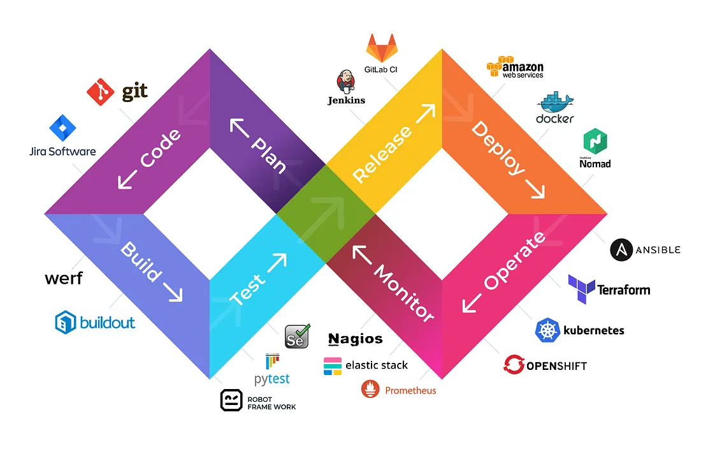

<h1 align="center">Hi 👋, I'm Bindiya M</h1>
<h3 align="center">A passionate about DevOps tools</h3>

  

- 🔭 I’m currently working on **DevOps** Projects

- 🌱 I’m currently learning and **upgrading my skill's of DevOps**

- 🤝 I’m looking for **Reference** help to get into "IT" back

- 👨‍💻 All of my projects are available at [https://www.linkedin.com/in/bindiya-m-14496biya/](https://www.linkedin.com/in/bindiya-m-14496biya/)

- 💬 Ask me about **DevOps Tools**

- 📫 How to reach me **samajika.jalathana@gmail.com**

<h3 align="left">Connect with me:</h3>

<h3 align="left">Languages and Tools:</h3>

                 

&nbsp;

